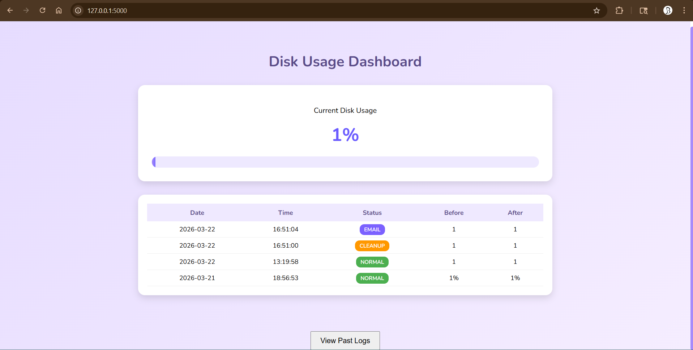
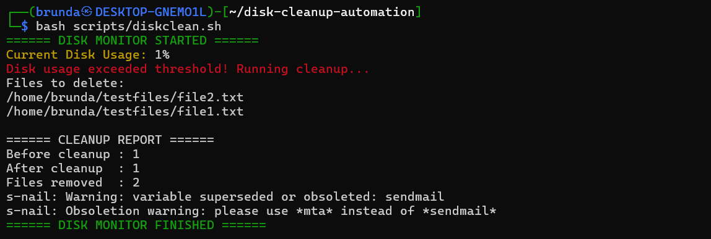
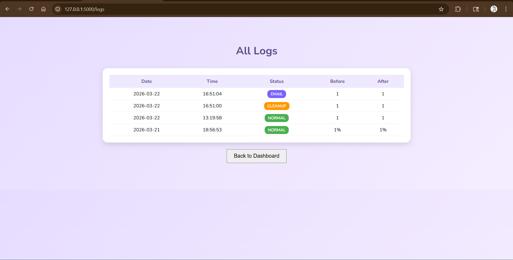
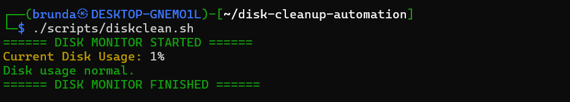
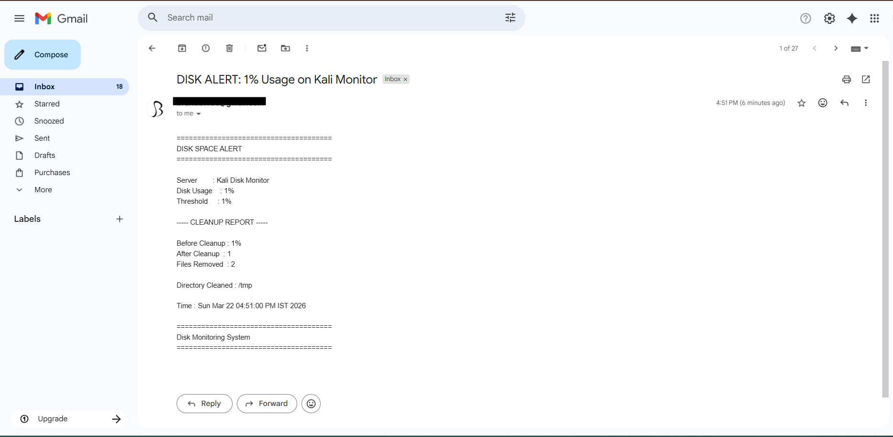
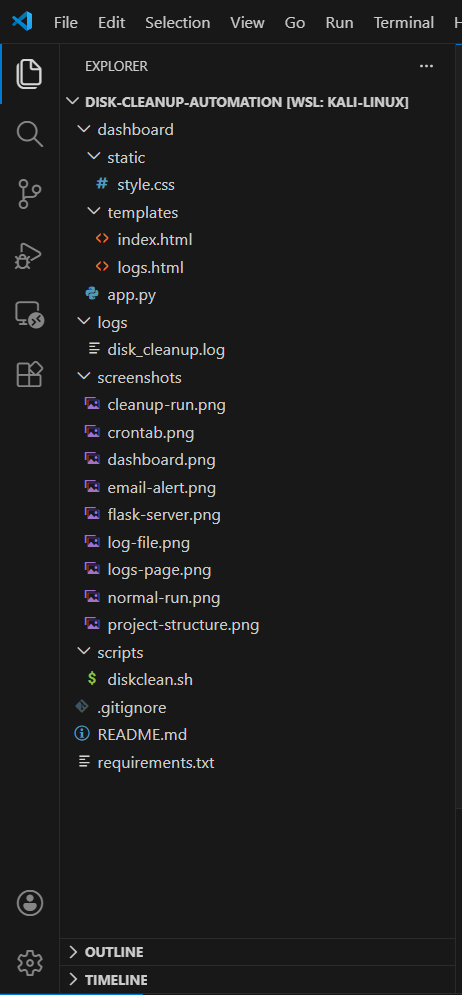

# Disk Cleanup Automation & Monitoring System
Automated disk cleanup system that monitors disk usage, triggers cleanup, logs activity, sends alerts, and provides a web dashboard. 


## Featurs
- Real-time Disk Usage Monitoring
- Automatic Cleanup when threshold is exceeded
- Log Tracking System
- Flask-based Web Dashboard
- Email Alerts on high disk usage
- Cron Job Scheduling (Automation)


## Project Structure

```
disk-cleanup-automation/
│
├── dashboard/
│   ├── static/
│   │   └── style.css
│   ├── templates/
│   │   ├── index.html
│   │   └── logs.html
│   |── app.py
│
├── logs/
│   └── disk_cleanup.log
│
├── scripts/
│   └── diskclean.sh
│
├── screenshots/
│
├── .gitignore
├── README.md
└── requirements.txt
```

## How It Works
1. Cron job runs the shell script periodically  
2. Script checks disk usage  
3. If threshold exceeded:
   - Deletes unnecessary files
   - Logs activity
   - Sends email alert  
4. Flask dashboard displays:
   - Current disk usage  
   - Recent logs  
   - Cleanup history  


## Setup Instructions
### 1. Clone the repository
git clone https://github.com/brunda6git/disk-cleanup-automation.git
cd disk-cleanup-automation

### 2. Install dependencies
pip install -r requirements.txt

### 3. Run Flask App
cd dashboard
python3 app.py

Open browser:
http://127.0.0.1:5000


## Setup Cron Job
crontab -e
Add:
0 * * * * /home/<your-username>/disk-cleanup-automation/scripts/diskclean.sh


## Screenshots
### Dashboard



### Cleanup Execution


### Logs Page



### Terminal Execution



### Email Alert



### Project Structure



## Tech Stack
- Python (Flask)
- Bash Scripting
- Linux Cron Jobs
- HTML/CSS


## Email Configuration
To enable email alerts, you need to configure your own email credentials.
Steps:
1. Enable 2-Step Verification on your Gmail account  
2. Generate an App Password from Google Account settings  
3. Use the App Password for sending emails via the script


## Why this project?
Manual disk cleanup is inefficient and error-prone. 
This project automates monitoring and cleanup to maintain system performance.


## Author
Brunda
